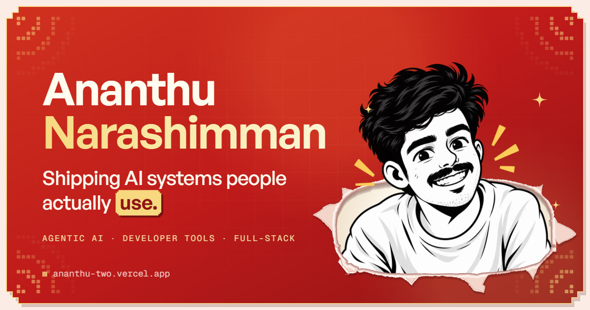

# Ananthu Narashimman · Portfolio

My personal site: a pixel-art portfolio for the AI agents, developer tools and full-stack products I build.

**Live at [ananthu.xyz](https://www.ananthu.xyz)**

[](https://www.ananthu.xyz)

## What's inside

- Pixel opening animation, then a hero with a torn-page portrait that follows the cursor
- Projects with detailed case-study pages, plus my published npm packages
- A tech stack marquee, a journey timeline and a hackathon diary with hand-drawn pixel city scenes
- A "Now" section with live GitHub stats and a hoverable contribution heatmap
- Contact and hackathon-invite forms that send email straight from the site
- Light and dark themes, scroll reveals, and animations tuned to stay smooth on low-end laptops

## Stack

React 19 · TypeScript · Vite · Tailwind CSS 4 · Motion · React Router · Vercel (hosting, functions, analytics) · Resend (email)

## Run it locally

```sh
npm install
npm run dev
```

`npm run dev` serves the site only. The contact form posts to a Vercel Function in `api/contact.ts`, so to try it locally run `npx vercel dev` with a `RESEND_API_KEY` environment variable set.

## Scripts

| Command | What it does |
| --- | --- |
| `npm run dev` | Start the dev server |
| `npm run build` | Type-check and build for production |
| `npm run preview` | Serve the production build |
| `npm run lint` | Lint with Oxlint |
